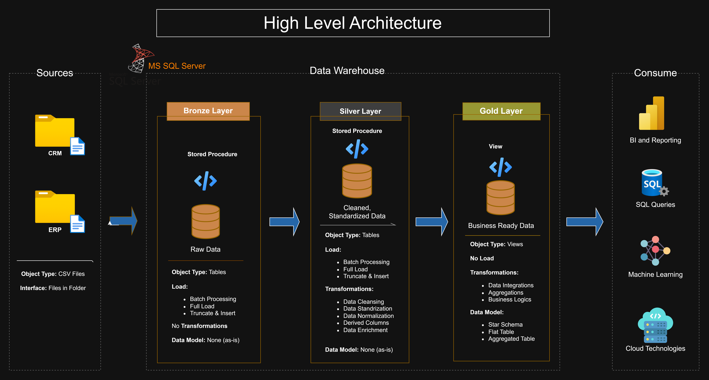

# Data Warehouse and Analytics Project 🚀

Building a modern data warehouse using SQL Server, including ETL processes, data modeling, and analytics.

---

## Overview

This project demonstrates the implementation of a modern Data Warehouse using SQL Server. It includes data ingestion, ETL processes, data cleaning, dimensional modeling, and analytics reporting.

The goal of this project is to build a structured and scalable data warehouse solution for analyzing sales data and generating business insights.

---

## Project Objectives

### Data Engineering

- Import data from CRM and ERP source systems (CSV files)
- Perform data cleaning and transformation
- Build ETL pipelines using SQL Server
- Design a layered data warehouse architecture:
  - Bronze Layer (Raw Data)
  - Silver Layer (Cleaned & Transformed Data)
  - Gold Layer (Business-ready Data)
- Create analytical data models using Star Schema

### Data Analytics

Develop SQL-based analytics to analyze:

- Customer behavior
- Product performance
- Sales trends

These insights help support business decision-making and reporting.

---

## Tech Stack

- SQL Server
- T-SQL
- ETL Processes
- Data Warehousing
- Star Schema Modeling
- Git & GitHub

---

## 🏗️ Data Architecture

The project follows the Medallion Architecture approach:


- Bronze Layer → Raw source data
- Silver Layer → Cleaned and transformed data
- Gold Layer → Business-ready analytical model

---

## Key Features

- Data Cleaning and Transformation
- ETL Pipeline Development
- Dimensional Data Modeling
- Fact and Dimension Tables
- Analytical SQL Queries
- Business Insight Generation

---

## 📂 Repository Structure
```
data-warehouse-project/
│
├── datasets/                           # Raw datasets used for the project (ERP and CRM data)
│
├── docs/                               # Project documentation and architecture details
│   ├── etl.drawio                      # Draw.io file shows all different techniquies and methods of ETL
│   ├── data_architecture.drawio        # Draw.io file shows the project's architecture
│   ├── data_catalog.md                 # Catalog of datasets, including field descriptions and metadata
│   ├── data_flow..drawio               # Draw.io file for the data flow diagram
│   ├── data_integration.drawio         # Draw.io file shows the data integration process across the data warehouse layers
│   ├── data_layers.drawio              # Images illustrating the Bronze, Silver, and Gold layers of the data warehouse
│   ├── data_models.drawio              # Draw.io file for data models (star schema)
│   ├── naming-conventions.md           # Consistent naming guidelines for tables, columns, and files
│
├── scripts/                            # SQL scripts for ETL and transformations
│   ├── bronze/                         # Scripts for extracting and loading raw data
│   ├── silver/                         # Scripts for cleaning and transforming data
│   ├── gold/                           # Scripts for creating analytical models
│
├── tests/                              # Test scripts and quality files
│
├── README.md                           # Project overview and instructions
├── LICENSE                             # License information for the repository
├── .gitignore                          # Files and directories to be ignored by Git
└── requirements.txt                    # Dependencies and requirements for the project
```
---

## Learning Outcomes

Through this project, I learned:

- Data warehouse design principles
- ETL pipeline development
- SQL optimization techniques
- Data modeling using Star Schema
- Real-world data engineering workflow

---

## Project Inspiration

This project was inspired by the SQL Data Warehouse Project by Baraa Khatib Salkini and was recreated as a hands-on learning experience.

---

## License

This project is licensed under the MIT License.

---

## About Me

I am an aspiring Data Analyst passionate about SQL, data engineering, and analytics.

Currently building hands-on projects to strengthen my skills in data warehousing and business intelligence.
